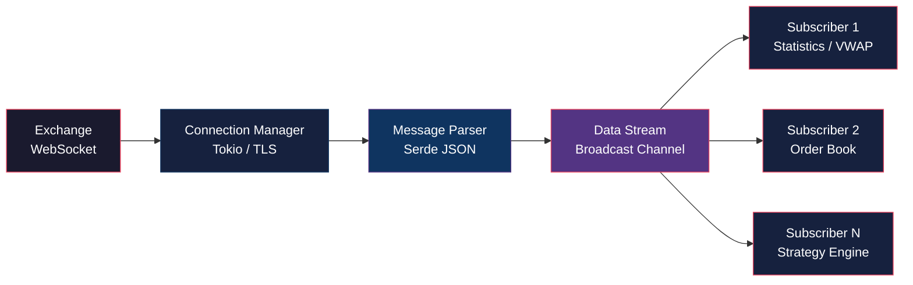

# 📊 Rust Market Data Stream

[](https://www.rust-lang.org/)
[](https://opensource.org/licenses/MIT)
[]()

[English](#english) | [Português](#português)

---

## English

### Overview

A high-performance real-time market data streaming and processing engine built with Rust. This library provides an async WebSocket client for consuming market data feeds, with support for trades, quotes, and full order book snapshots.



### Key Features

- **Async WebSocket Client**: Built on Tokio and tokio-tungstenite for efficient I/O
- **Multiple Data Types**: Trades, quotes (BBO), and order book snapshots
- **Real-Time Statistics**: VWAP, high/low tracking, volume aggregation
- **Broadcast Channels**: Efficient message distribution to multiple consumers
- **Type-Safe Parsing**: Serde-based JSON deserialization
- **Error Handling**: Comprehensive error types with automatic reconnection support
- **Production Ready**: Structured logging with tracing

### Architecture

```
┌──────────────────────────────────────┐
│     WebSocket Server (Exchange)      │
└──────────────┬───────────────────────┘
               │ Market Data Feed
               ▼
┌──────────────────────────────────────┐
│    MarketDataClient (Tokio WS)       │
│  ┌────────────────────────────────┐  │
│  │  Message Parser (Serde JSON)   │  │
│  └────────────┬───────────────────┘  │
│               │                       │
│  ┌────────────▼───────────────────┐  │
│  │  Broadcast Channel (tokio)     │  │
│  └────────────┬───────────────────┘  │
└───────────────┼───────────────────────┘
                │
        ┌───────┴───────┐
        ▼               ▼
   Consumer 1      Consumer 2
   (Statistics)    (Order Book)
```

### Installation

Add to your `Cargo.toml`:

```toml
[dependencies]
rust-market-data-stream = "0.1.0"
```

### Quick Start

```rust
use rust_market_data_stream::{MarketDataClient, MarketDataMessage};

#[tokio::main]
async fn main() {
    // Create client
    let client = MarketDataClient::new(
        "wss://api.exchange.com/stream".to_string(),
        1000  // Buffer size
    );
    
    // Subscribe to data stream
    let mut receiver = client.subscribe();
    
    // Start streaming
    client.start().await.unwrap();
    
    // Process messages
    while let Ok(msg) = receiver.recv().await {
        match msg {
            MarketDataMessage::Trade(trade) => {
                println!("Trade: {} @ {} (qty: {})", 
                         trade.symbol, trade.price, trade.quantity);
            }
            MarketDataMessage::Quote(quote) => {
                println!("Quote: {} - spread: {:.2}", 
                         quote.symbol, quote.spread());
            }
            MarketDataMessage::OrderBook(book) => {
                println!("OrderBook: {} - depth: {}", 
                         book.symbol, book.bids.len() + book.asks.len());
            }
            _ => {}
        }
    }
}
```

### Market Statistics Example

```rust
use rust_market_data_stream::{MarketStats, MarketDataMessage};

let mut stats = MarketStats::new("BTCUSD".to_string());

while let Ok(msg) = receiver.recv().await {
    if let MarketDataMessage::Trade(trade) = msg {
        stats.update_with_trade(&trade);
        
        println!("VWAP: {:.2}", stats.vwap);
        println!("High: {:.2}, Low: {:.2}", stats.high, stats.low);
        println!("Volume: {:.2}", stats.total_volume);
    }
}
```

### Data Types

#### Trade
```rust
pub struct Trade {
    pub symbol: String,
    pub price: f64,
    pub quantity: f64,
    pub side: TradeSide,
    pub timestamp: DateTime<Utc>,
    pub trade_id: String,
}
```

#### Quote (Best Bid/Offer)
```rust
pub struct Quote {
    pub symbol: String,
    pub bid_price: f64,
    pub bid_size: f64,
    pub ask_price: f64,
    pub ask_size: f64,
    pub timestamp: DateTime<Utc>,
}
```

#### Order Book Snapshot
```rust
pub struct OrderBookSnapshot {
    pub symbol: String,
    pub bids: Vec<PriceLevel>,
    pub asks: Vec<PriceLevel>,
    pub timestamp: DateTime<Utc>,
}
```

### Use Cases

- **Algorithmic Trading**: Real-time data feed for trading strategies
- **Market Making**: Order book monitoring and quote generation
- **Analytics**: Market microstructure analysis and research
- **Risk Management**: Real-time position and exposure monitoring
- **Data Recording**: Historical data collection and replay

### Technical Highlights

- **Zero-Copy Deserialization**: Efficient JSON parsing with Serde
- **Async/Await**: Non-blocking I/O with Tokio runtime
- **Broadcast Channels**: Multiple consumers without cloning data
- **Automatic Reconnection**: Built-in connection recovery (planned)
- **Structured Logging**: Production-ready observability with tracing

### Project Structure

```
rust-market-data-stream/
├── src/
│   ├── lib.rs           # Library entry point
│   ├── types.rs         # Data structures
│   └── client/
│       └── mod.rs       # WebSocket client
├── examples/
│   └── stream_example.rs
├── Cargo.toml
└── README.md
```

### License

MIT License - see LICENSE file for details.

### Author

**Gabriel Demetrios Lafis**

---

## Português

### Visão Geral

Um motor de streaming e processamento de dados de mercado em tempo real de alta performance construído com Rust. Esta biblioteca fornece um cliente WebSocket assíncrono para consumir feeds de dados de mercado, com suporte para trades, cotações e snapshots completos de order book.

### Características Principais

- **Cliente WebSocket Assíncrono**: Construído sobre Tokio e tokio-tungstenite para I/O eficiente
- **Múltiplos Tipos de Dados**: Trades, cotações (BBO) e snapshots de order book
- **Estatísticas em Tempo Real**: VWAP, rastreamento de máximas/mínimas, agregação de volume
- **Canais de Broadcast**: Distribuição eficiente de mensagens para múltiplos consumidores
- **Parsing Type-Safe**: Desserialização JSON baseada em Serde
- **Tratamento de Erros**: Tipos de erro abrangentes com suporte a reconexão automática
- **Pronto para Produção**: Logging estruturado com tracing

### Instalação

Adicione ao seu `Cargo.toml`:

```toml
[dependencies]
rust-market-data-stream = "0.1.0"
```

### Início Rápido

```rust
use rust_market_data_stream::{MarketDataClient, MarketDataMessage};

#[tokio::main]
async fn main() {
    // Criar cliente
    let client = MarketDataClient::new(
        "wss://api.exchange.com/stream".to_string(),
        1000  // Tamanho do buffer
    );
    
    // Inscrever-se no stream de dados
    let mut receiver = client.subscribe();
    
    // Iniciar streaming
    client.start().await.unwrap();
    
    // Processar mensagens
    while let Ok(msg) = receiver.recv().await {
        match msg {
            MarketDataMessage::Trade(trade) => {
                println!("Trade: {} @ {} (qtd: {})", 
                         trade.symbol, trade.price, trade.quantity);
            }
            MarketDataMessage::Quote(quote) => {
                println!("Cotação: {} - spread: {:.2}", 
                         quote.symbol, quote.spread());
            }
            MarketDataMessage::OrderBook(book) => {
                println!("OrderBook: {} - profundidade: {}", 
                         book.symbol, book.bids.len() + book.asks.len());
            }
            _ => {}
        }
    }
}
```

### Casos de Uso

- **Trading Algorítmico**: Feed de dados em tempo real para estratégias de trading
- **Market Making**: Monitoramento de order book e geração de cotações
- **Analytics**: Análise de microestrutura de mercado e pesquisa
- **Gestão de Risco**: Monitoramento de posição e exposição em tempo real
- **Gravação de Dados**: Coleta e replay de dados históricos

### Licença

Licença MIT - veja o arquivo LICENSE para detalhes.

### Autor

**Gabriel Demetrios Lafis**
